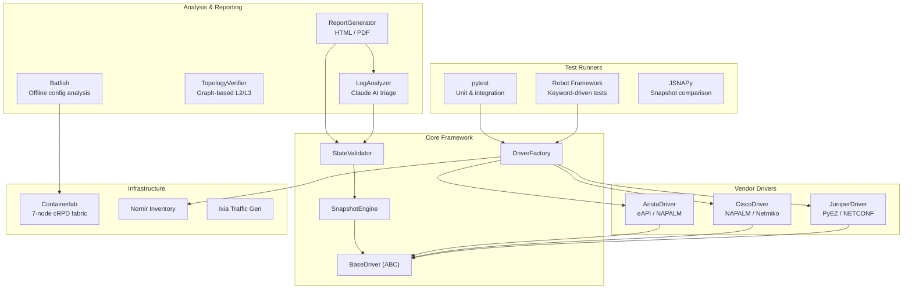

# Network Test Automation Framework

[](https://github.com/example/network-test-automation-framework/actions/workflows/ci.yml)
[](https://www.python.org/downloads/)
[](LICENSE)
[](https://github.com/psf/black)
[](https://github.com/astral-sh/ruff)

**Production-grade, vendor-agnostic network test automation with multi-vendor support (Juniper/Cisco/Arista), Robot Framework integration, Batfish offline analysis, and AI-powered defect triage.**

---

## Architecture



## Features

- **Vendor-Agnostic Driver Abstraction** — Unified interface for Juniper (PyEZ), Cisco (NAPALM/Netmiko), and Arista (eAPI) with Factory Pattern instantiation
- **Snapshot & Diff Engine** — Capture full device state (BGP, OSPF, EVPN, interfaces, LLDP) and compute structured pre/post diffs
- **Assertion-Based Validation** — `assert_bgp_neighbor_established()`, `assert_interface_up()`, `assert_route_exists()`, and more
- **Batfish Offline Analysis** — Routing table verification, traceroute simulation, ACL reachability, and loop detection without touching live devices
- **Graph-Based Topology Verification** — LLDP-derived adjacency graph with connectivity checks and unidirectional link detection
- **AI-Powered Failure Triage** — Claude API integration for automated root cause analysis and structured defect reports
- **Robot Framework Integration** — Keyword-driven test suites for topology, BGP, EVPN-VXLAN, and failover convergence
- **JSNAPy Snapshot Testing** — YAML-based pre/post state comparison for Juniper devices
- **Rich HTML Reports** — Jinja2-templated reports with Mermaid topology diagrams, pass/fail summaries, and AI triage output
- **Containerlab Topology** — 7-node leaf-spine fabric (2 spines + 4 leaves + WAN edge) with OSPF underlay and iBGP/EVPN overlay
- **Full CI/CD Pipeline** — GitHub Actions for linting, type checking, testing, and release automation

## Quick Start

```bash
# Clone the repository
git clone https://github.com/example/network-test-automation-framework.git
cd network-test-automation-framework

# Create a virtual environment
python3 -m venv .venv
source .venv/bin/activate

# Install with all dependencies
pip install -e ".[all-vendors,nornir,batfish,triage,reporting,robot,dev,test]"

# Run the unit tests
make test
```

## Usage Examples

### Connect to a Device and Collect State

```python
from src.core.base_driver import DeviceInfo
from src.drivers.driver_factory import DriverFactory

factory = DriverFactory()
info = DeviceInfo(
    hostname="spine1",
    vendor="juniper",
    platform="junos",
    username="admin",
    password="admin123",
    port=830,
)

with factory.create("juniper", info) as driver:
    bgp = driver.get_bgp_neighbors()
    interfaces = driver.get_interfaces()
    snapshot = driver.take_snapshot("baseline")
```

### Validate Network State

```python
from src.core.validator import StateValidator

validator = StateValidator(device="spine1")

# Check individual assertions
result = validator.assert_bgp_neighbor_established(bgp_data, "10.0.0.1")
print(f"BGP check: {'PASS' if result.passed else 'FAIL'} — {result.message}")

# Run comprehensive validation
report = validator.run_full_validation(
    bgp_data=bgp,
    interface_data=interfaces,
    routing_data=routes,
    lldp_data=lldp,
    evpn_data=evpn,
)
print(report.summary())
```

### Pre/Post Change Comparison

```python
from src.core.snapshot_engine import SnapshotEngine

engine = SnapshotEngine()

with factory.create("juniper", info) as driver:
    pre = engine.capture(driver, "pre-change")

    driver.push_config("set interfaces et-0/0/0 description 'Updated'")

    post = engine.capture(driver, "post-change")
    diff = engine.diff(pre, post)

    for entry in diff.diffs:
        print(f"  [{entry.action}] {entry.category}/{entry.key}")
```

### AI-Powered Failure Triage

```python
from src.triage.log_analyzer import LogAnalyzer

analyzer = LogAnalyzer()  # Uses ANTHROPIC_API_KEY env var
report = analyzer.analyze_failure(
    test_name="test_bgp_established",
    error_output="AssertionError: BGP peer 10.0.0.1 state=active",
    device_logs="rpd: BGP peer 10.0.0.1 NOTIFICATION sent ...",
    device="spine1",
)
print(report.to_markdown())
```

## Lab Topology

Deploy the 7-node containerlab topology:

```bash
# Start the fabric
make topology-up

# Verify connectivity
make topology-inspect

# Tear down
make topology-down
```

The topology includes:
- **2 Spine switches** (cRPD) — OSPF + iBGP Route Reflectors
- **4 Leaf switches** (cRPD) — EVPN-VXLAN with VNI 10100/10200
- **1 WAN Edge** (cRPD) — eBGP peering to spine1

## Project Structure

```
network-test-automation-framework/
├── src/
│   ├── core/               # Base abstractions, snapshot engine, validators
│   ├── drivers/            # Vendor-specific implementations + factory
│   ├── inventory/          # Nornir-based inventory management
│   ├── analysis/           # Batfish + topology graph verification
│   ├── traffic/            # Traffic generator abstractions (Ixia)
│   ├── triage/             # AI-powered failure analysis (Claude)
│   └── reporting/          # HTML/PDF report generation (Jinja2)
├── tests/
│   ├── unit/               # Unit tests (all I/O mocked)
│   ├── integration/        # Integration tests (live devices)
│   └── conftest.py         # Shared pytest fixtures
├── robot_tests/            # Robot Framework test suites
├── jsnapy/                 # JSNAPy snapshot test definitions
├── topology/               # Containerlab topology + device configs
├── docs/                   # Architecture, setup, contributing guides
├── .github/workflows/      # CI/CD pipeline definitions
├── pyproject.toml          # Python packaging + tool configuration
├── Makefile                # Developer workflow shortcuts
└── docker-compose.yml      # Batfish + supporting services
```

## Development

```bash
# Install dev dependencies
make dev-install

# Run the full CI pipeline locally
make ci

# Individual checks
make lint          # Ruff linting
make format        # Black + Ruff formatting
make type-check    # mypy type checking
make test          # pytest with coverage
```

## Contributing

See [docs/contributing.md](docs/contributing.md) for guidelines on:
- Adding new vendor drivers
- Writing tests
- Code style requirements
- Commit message conventions

## License

This project is licensed under the MIT License. See [LICENSE](LICENSE) for details.
