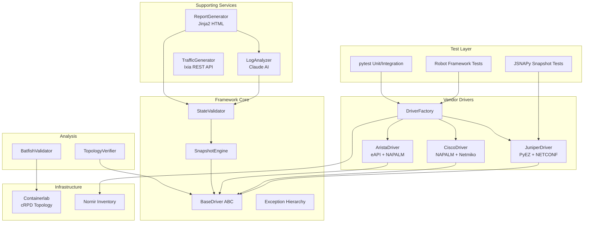

# Architecture Decision Records

## Overview

The Network Test Automation Framework follows a layered architecture with clear separation of concerns. Each layer communicates through well-defined interfaces (abstract base classes and data models).

## Architecture Diagram

## ADR-001: Abstract Base Class for Drivers

**Status:** Accepted

**Context:** We need to support multiple vendor platforms (Juniper, Cisco, Arista) with a unified interface.

**Decision:** Use Python's `abc.ABC` to define `BaseDriver` with abstract methods for all data collection operations. Each vendor implements the full interface using their native SDK.

**Consequences:**
- New vendors can be added by subclassing `BaseDriver`
- Test code is vendor-agnostic
- Type safety via the common interface

## ADR-002: Factory Pattern for Driver Instantiation

**Status:** Accepted

**Context:** Tests should not need to know which driver class to instantiate.

**Decision:** `DriverFactory` maps vendor/platform strings to driver classes and creates instances from Nornir inventory data.

**Consequences:**
- Single point of driver creation
- Easy to register custom drivers
- Inventory-driven automation

## ADR-003: Snapshot-Based State Comparison

**Status:** Accepted

**Context:** Pre/post change validation requires capturing and comparing device state.

**Decision:** `SnapshotEngine` captures all device state as a `Snapshot` dataclass, persists to JSON, and computes structured `SnapshotDiff` objects.

**Consequences:**
- State is serializable and auditable
- Diffs are deterministic and machine-readable
- Historical snapshots for trend analysis

## ADR-004: AI-Powered Triage via Claude API

**Status:** Accepted

**Context:** Manual failure triage is time-consuming and requires deep protocol knowledge.

**Decision:** Use the Anthropic Claude API to analyze test failures and device logs, producing structured `DefectReport` objects.

**Consequences:**
- Faster triage of complex failures
- Consistent defect report format
- Requires API key and network access
- Fallback to manual analysis when API is unavailable

## ADR-005: Containerlab for Lab Topology

**Status:** Accepted

**Context:** Integration tests need a realistic multi-vendor topology.

**Decision:** Use Containerlab with Juniper cRPD containers for a 7-node leaf-spine fabric.

**Consequences:**
- Reproducible lab environment
- Real JunOS control plane for accurate testing
- Lightweight (containers vs. full VMs)
- Requires Docker and containerlab installation
